===========
Quick Start
===========

This short tutorial will demonstrate some of the capabilities of ChiantiPy and the CHIANTI database.  It assumes that you know what the CHIANTI database provides and why you want to use it.  It is useful to begin by exploring the properties of the **ion class**, as much of ChiantiPy is based on it.  An ion such as Fe XIV is specified by the string 'fe_14', in the usual CHIANTI notation.

Perhaps the easiest way is to use a jupyter-notebook or a jupyter3-notebook to load the quick start notebook file QuickStart.ipynb in the directory ipython_notebooks.  Then, just run each cell step by step.  If you are not familiar with notebooks, then you can cut and paste the following code into a Python/IPython session.

N.B.:  in the time some of the plots and data were produced, there have been some changes to ChiantiPy and CHIANTI.  It is possible that you might find difference (hopefully small).

Bring up a Python session (using > Python -i ), or better yet, an IPython session

::

  import ChiantiPy.core as ch
  import numpy as np
  import matplotlib.pyplot as plt

What we will really be interested in are various properties of the Fe XIV emissivities as a function of temperature and density.  So, let's define a numpy array of temperatures

::

  t = 10.**(5.8 + 0.05*np.arange(21.))

In ChiantiPy, temperatures are currently given in degrees Kelvin and densities as the number electron density per cubic cm.  Then, construct fe14 as would be typically done

::

  fe14 = ch.ion('fe_14', temperature=t, eDensity=1.e+9, em=1.e+27)

note that eDensity is the new keyword for electron density

Level populations
-----------------

::

  fe14.popPlot()

produces a matplotlib plot window were the population of the top 10 (the default) levels are plotted as a function of temperature.

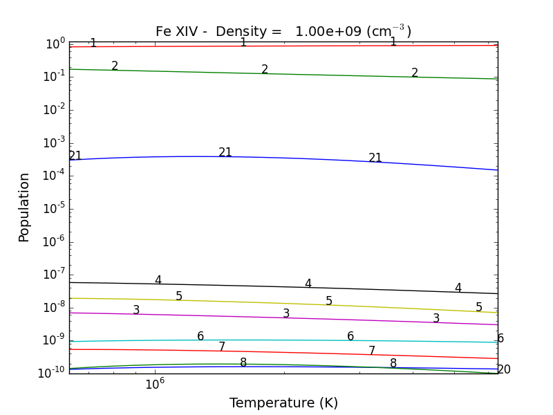

If the level populations had not already been calculated, popPlot() would have invoked the populate() method which calculates the level populations and stores them in the Population dictionary, with keys = ['protonDensity', 'population', 'temperature', 'density'].

A ChiantiPy Convention
----------------------

Classes and function of ChiantiPy start with lower case letters.  Data/attributes that are attached to the instantiation of a class will start with a capital letter.  For example,

::

  fe14.populate() creates fe14.Population containing the level population information

  fe14.intensity() created fe14.Intensity contain the line intensities information

  fe14.spectrum() creates fe14.Spectrum contain the line and continuum spectrum information

Spectral Line Intensities
-------------------------

::

  fe14.intensityPlot(wvlRange=[210.,220.],linLog='log')

will plot the intensities for the top (default = 10) lines in the specified wavelength range.  If the **Intensity** attribute has not yet been calculated, it will calculate it.  Since there are 21 temperature involved, a single temperature is selected (21/2 = 10).  Otherwise,

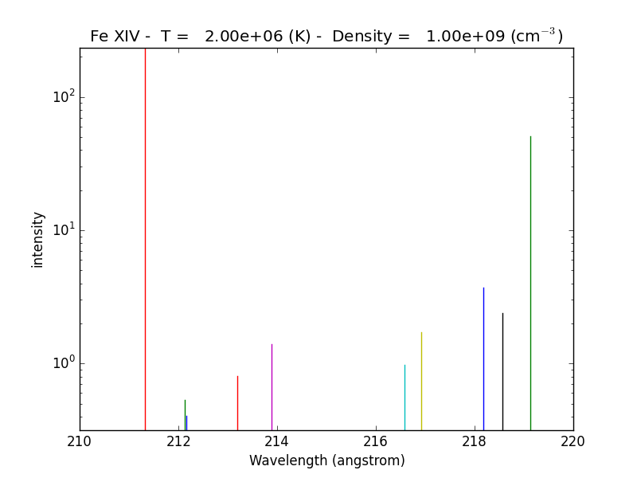

::

  fe14.intensityPlot(index=2, wvlRange=[210., 220.], linLog = 'log')

plots the intensities for a temperature = t[2] = 7.9e+5, in this case.  And, by specifying relative = 1, the emissivities will be plotted relative to the strongest line.

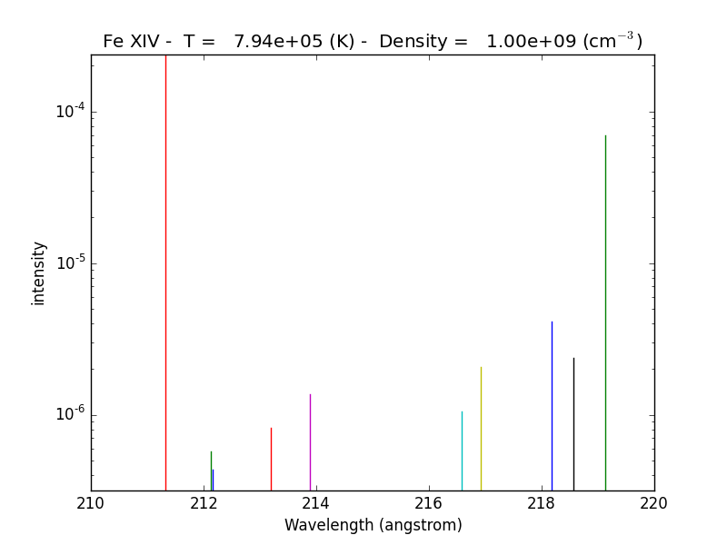

::

  fe14.intensityList(wvlRange=[200,220], index=10)

gives the following terminal output:

::

  using index =    10 specifying temperature =   2.00e+06, eDensity =    1.00e+09 em =   1.00e+27

  ------------------------------------------

  Ion  lvl1  lvl2                     lower - upper                           Wvl(A)    Intensity      A value Obs
  fe_14     1    11              3s2.3p 2P0.5 - 3s2.3d 2D1.5                  211.3172    2.336e+02     3.81e+10 Y
  fe_14     4    27              3s.3p2 4P1.5 - 3s.3p(3P).3d 4P1.5            212.1255    5.355e-01     2.21e+10 Y
  fe_14     4    28              3s.3p2 4P1.5 - 3s.3p(3P).3d 4D2.5            212.1682    4.039e-01     1.15e+10 Y
  fe_14     3    24              3s.3p2 4P0.5 - 3s.3p(3P).3d 4D0.5            213.1955    8.073e-01     4.26e+10 Y
  fe_14     3    23              3s.3p2 4P0.5 - 3s.3p(3P).3d 4D1.5            213.8822    1.393e+00     2.97e+10 Y
  fe_14     5    28              3s.3p2 4P2.5 - 3s.3p(3P).3d 4D2.5            216.5786    9.736e-01     2.83e+10 Y
  fe_14     5    25              3s.3p2 4P2.5 - 3s.3p(3P).3d 4D3.5            216.9173    1.730e+00     4.29e+10 Y
  fe_14     7    32              3s.3p2 2D2.5 - 3s.3p(3P).3d 2F3.5            218.1767    3.734e+00     1.70e+10 Y
  fe_14     4    22              3s.3p2 4P1.5 - 3s.3p(3P).3d 4P2.5            218.5725    2.391e+00     2.65e+10 Y
  fe_14     2    12              3s2.3p 2P1.5 - 3s2.3d 2D2.5                  219.1305    5.077e+01     4.27e+10 Y

 ------------------------------------------

optionally, an output file could also be created by setting the keyword outFile to the name of the desired name

::

  fe14.intensityList(wvlRange=[210.,220.], relative=1, index=11)

give the following terminal/notebook output

::

  using index =    11 specifying temperature =   2.24e+06, eDensity =    1.00e+09 em =   1.00e+27

  ------------------------------------------

  Ion  lvl1  lvl2                     lower - upper                           Wvl(A)    Intensity      A value Obs
  fe_14     1    11              3s2.3p 2P0.5 - 3s2.3d 2D1.5                  211.3172    1.000e+00     3.81e+10 Y
  fe_14     4    27              3s.3p2 4P1.5 - 3s.3p(3P).3d 4P1.5            212.1255    2.267e-03     2.21e+10 Y
  fe_14     4    28              3s.3p2 4P1.5 - 3s.3p(3P).3d 4D2.5            212.1682    1.694e-03     1.15e+10 Y
  fe_14     3    24              3s.3p2 4P0.5 - 3s.3p(3P).3d 4D0.5            213.1955    3.390e-03     4.26e+10 Y
  fe_14     3    23              3s.3p2 4P0.5 - 3s.3p(3P).3d 4D1.5            213.8822    5.891e-03     2.97e+10 Y
  fe_14     5    28              3s.3p2 4P2.5 - 3s.3p(3P).3d 4D2.5            216.5786    4.083e-03     2.83e+10 Y
  fe_14     5    25              3s.3p2 4P2.5 - 3s.3p(3P).3d 4D3.5            216.9173    7.085e-03     4.29e+10 Y
  fe_14     7    32              3s.3p2 2D2.5 - 3s.3p(3P).3d 2F3.5            218.1767    1.557e-02     1.70e+10 Y
  fe_14     4    22              3s.3p2 4P1.5 - 3s.3p(3P).3d 4P2.5            218.5725    1.009e-02     2.65e+10 Y
  fe_14     2    12              3s2.3p 2P1.5 - 3s2.3d 2D2.5                  219.1305    2.096e-01     4.27e+10 Y

 ------------------------------------------

G(n,T) function
---------------

::

  fe14.gofnt(wvlRange=[210., 220.],top=3)

brings up a matplotlib plot window which shows the emissivities of the top (strongest) 3 lines in the wavelength region from 210 to 220 Angstroms.

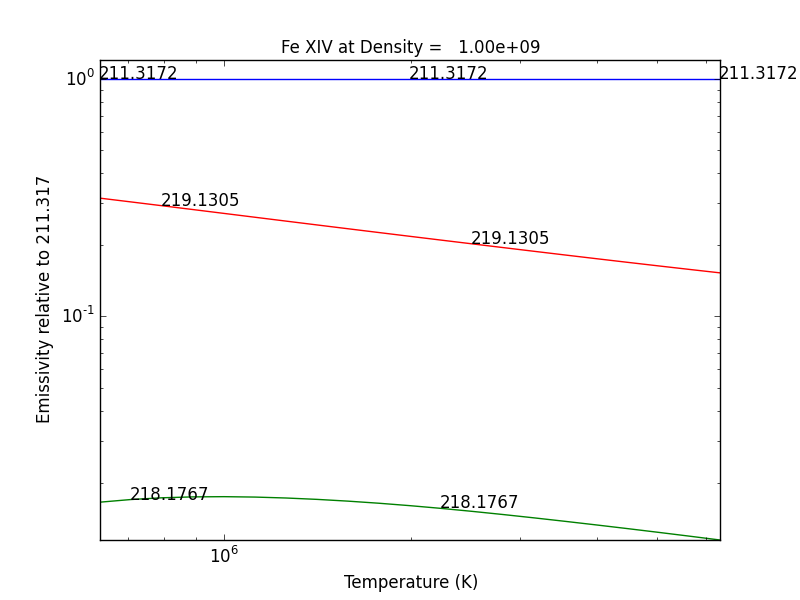

quickly followed by a dialog where the line(s) of interest can be specified

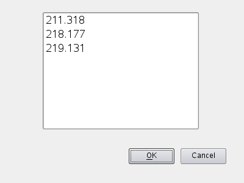

and finally a plot of the G(n,T) function for the specified lines(s).

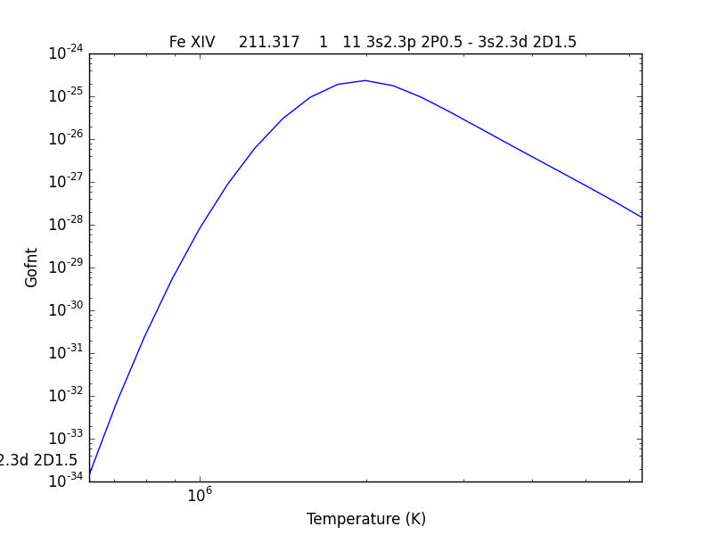

The G(n,T) calculation is stored in the Gofnt dictionary, with keys = ['gofnt', 'temperature', 'density']

while the is a fairly straightforward way to get a G(T) function, it is not very practical to use for a more than a handful of lines. For if the fe_14 line at 211.3172 is in a list of lines to be analyzed, a more practical way is the following

::

  fe14.intensity()
  dist = np.abs(np.asarray(fe14.Intensity['wvl']) - 211.3172)
  idx = np.argmin(dist)
  print(' wvl = %10.3f '%(fe14.Intensity['wvl'][idx]))

prints

wvl =    211.317

::

  plt.loglog(temp,fe14.Intensity['intensity'][:,idx])

once the axes are properly scaled, this produces the same values as fe14.Gofnt['gofnt']

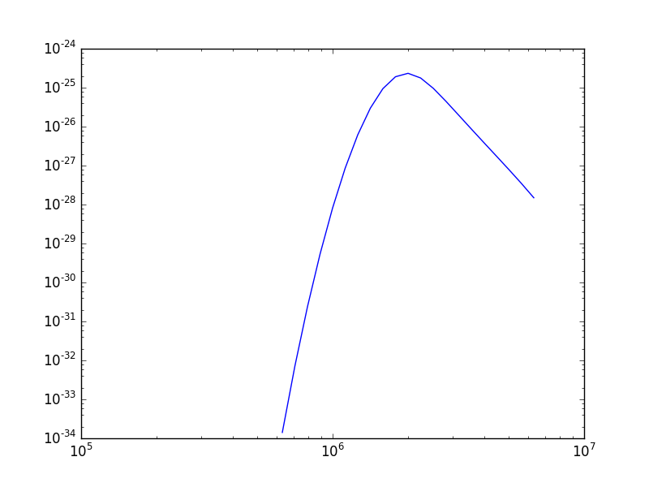

Intensity Ratios
----------------

::

  fe14.intensityRatio(wvlRange=[210., 225.])

this brings up a plot showing the relative emissivities on the Fe XIV lines

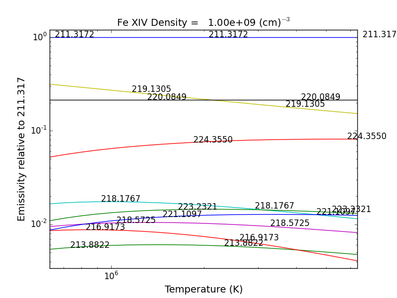

following by a dialog where you can selector the numerator(s) and denominator(s) of the desired intensity ratio

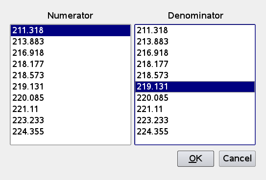

so the specified ratio is then plotted

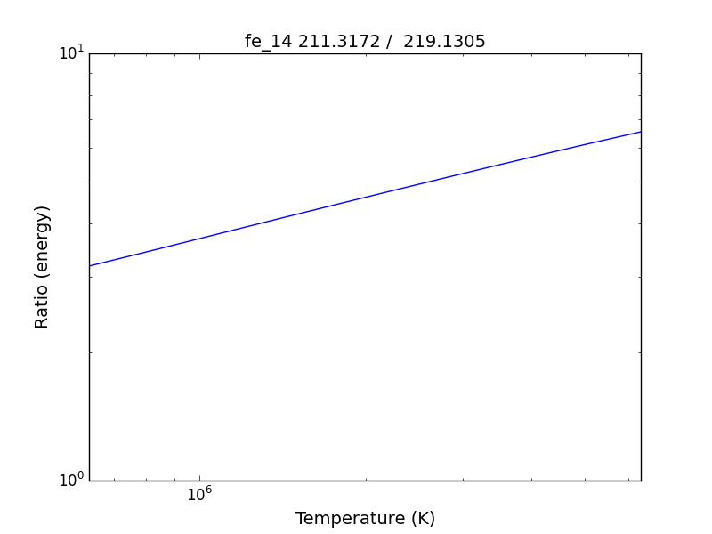

if previously, we had done

::

  dens = 10.**(6. + 0.1*arange(61))
  fe14 = ch.ion('fe_14', 2.e+6, dens)
  fe14.intensityRatio(wvlRange=[210., 225.])

then the plot of relative intensities vs density would appear

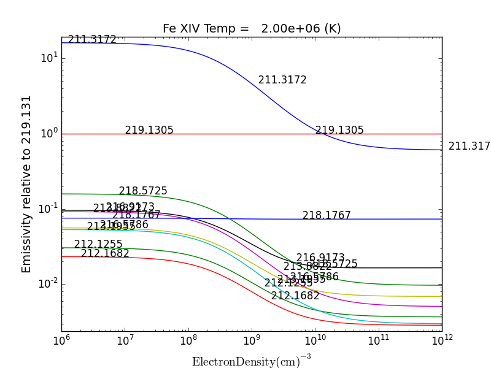

the same numerator/denominator selector dialog would come up and when 2 or more lines are selected, the intensity ratio versus density appears.

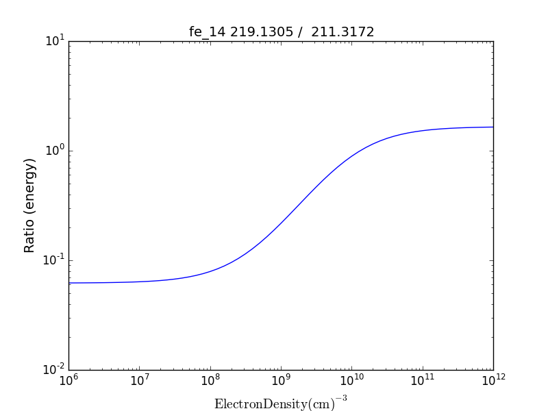

to obtain ratios of lines widely separated in wavelength, the wvlRanges keyword can be used:

::

 fe12 = ch.ion('fe_12', temperature=t, eDensity=1.e+9
 fe12.intensityRatio(wvlRanges=[[190.,200.],[1240.,1250.]])

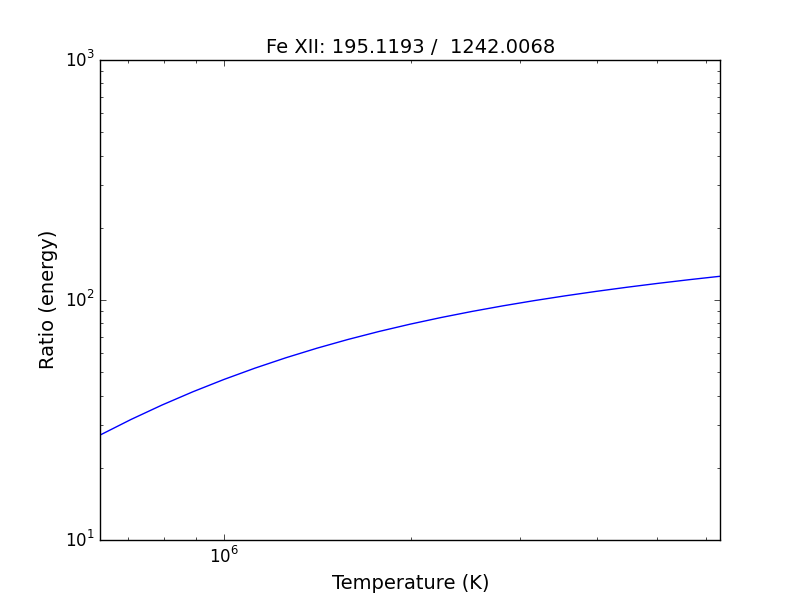

Spectra of a single ion
-----------------------

::

  fe14 = ch.ion('fe_14', temperature = 2.e+6, density = 1.e+9)
  wvl = wvl=200. + 0.125*arange(801)
  fe14.spectrum(wvl, em=1.e+27)
  plot(wvl, fe14.Spectrum['intensity'])

this will calculate the spectrum of fe_14 over the specified wavelength range and filter it with the default filter which is a gaussian (filters.gaussianR) with a 'resolving power' of 1000 which gives a gaussian width of wvl/1000.

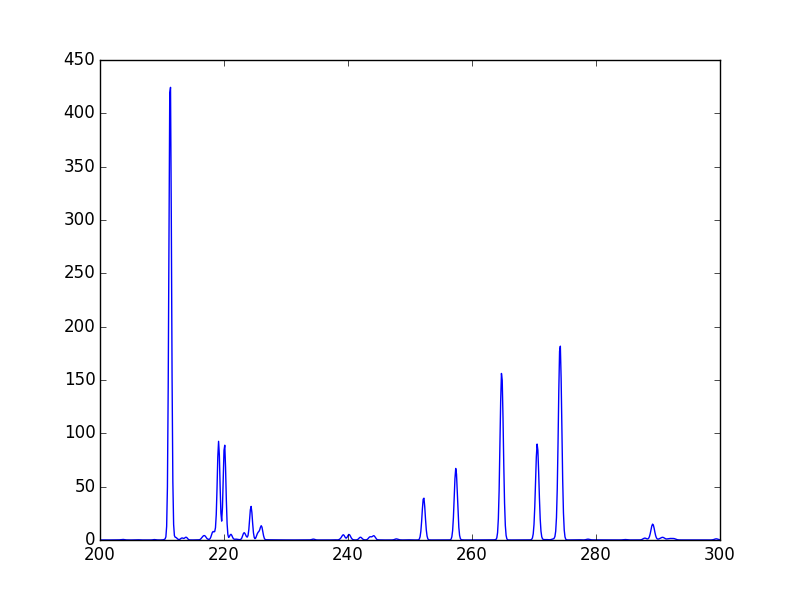

other filters available in chianti.filters include a boxcar filter and a gaussian filter where the width can be specified directly

::

  if hasattr(fe14,'Em'):
      print(' Emission Measure = %12.2e'%(fe14.Em))
  else:
      print(' the value for the emission measure is unspecified')

Emission Measure =     1.00e+27

::

  import chianti.filters as chfilters
  fe14.spectrum(wvl,filter=(chfilters.gaussian,.04))

calculates the spectrum of fe_14 for a gaussian filter with a width of 0.04 Angstroms.
The current value of the spectrum is kept in fe14.Spectrum with the following keys:

::

  for akey in sorted(fe14.Spectrum.keys()):
      print(' %10s'%(akey))

allLines
em
filter
filterWidth
intensity
wvl
xlabel
ylabel

::

  plot(wvl,fe14.Spectrum['intensity'])
  plt.xlabel(fe14.Spectrum['xlabel'])
  plt.ylabel(fe14.Spectrum['ylabel'])

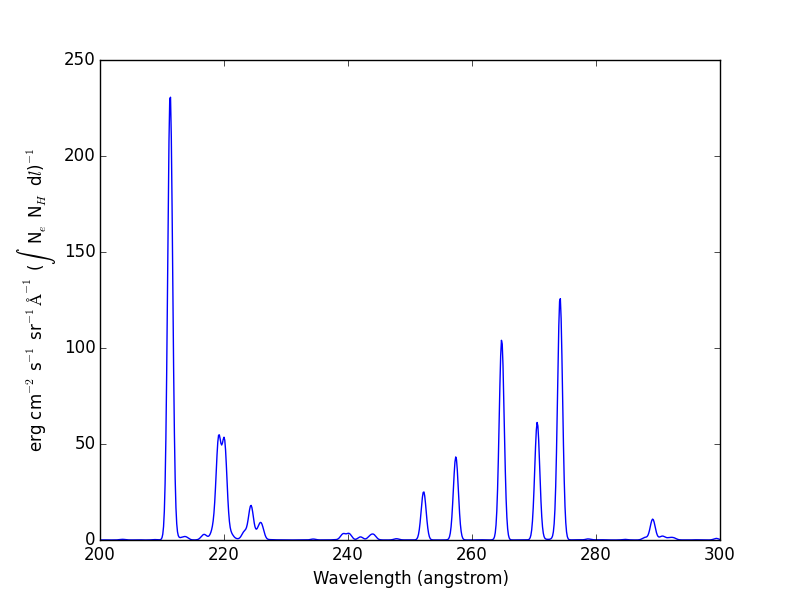

New in **ChiantiPy 0.6**, the *label* keyword has been added to the ion.spectrum method, and also to the other various spectral classes. This allows several spectral calculations for different filters to be saved and compared

::

  temp = 10.**(5.8 + 0.1*np.arange(11.))
  dens = 1.e+9
  fe14 = ch.ion('fe_14', temp, dens)
  emeas = np.ones(11,'float64')*1.e+27
  wvl = 200. + 0.125*np.arange(801)
  fe14.spectrum(wvl,filter=(chfilters.gaussian,.4),label='.4',em=emeas, label='0.4')
  fe14.spectrum(wvl,filter=(chfilters.gaussian,1.),label='1.', label-'1.0')
  plt.plot(wvl,fe14.Spectrum['.4']['intensity'][5])
  plt.plot(wvl,fe14.Spectrum['1.']['intensity'][5],'-r')
  plt.xlabel(fe14.Spectrum['.4']['xlabel'])
  plt.ylabel(fe14.Spectrum['.4']['ylabel'])
  plt.legen(loc='upper right')

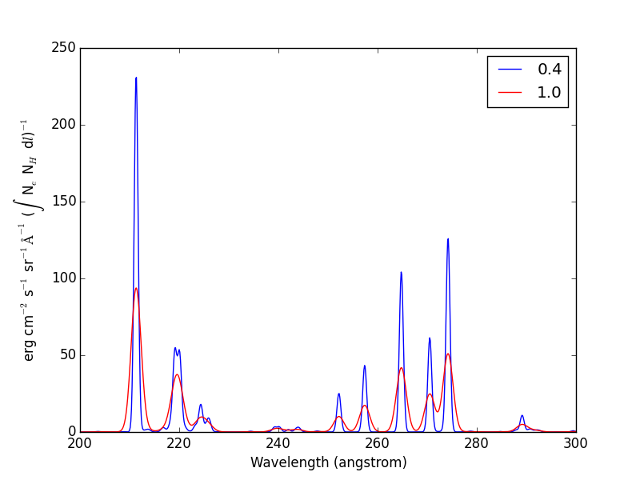

Free-free and free-bound continuum
----------------------------------

The module continuum provides the ability to calculate the free-free and free-bound spectrum for a large number of  individual ions.  The two-photon continuum is produced only by the hydrogen-like and helium-like ions

::

  temperature = 2.e+7
  c = ch.continuum('fe_25', temperature = temperature)
  wvl = 1. + 0.002*arange(4501)
  c.freeFree(wvl)
  plot(wvl, c.FreeFree['intensity'])
  c.freeBound(wvl)
  plot(wvl, c.FreeBound['intensity'])
  fe25=ch.ion('fe_25',2.e+7,1.e+9,em=1.e+27)
  fe25.twoPhoton(wvl)
  plt.plot(wvl,fe25.TwoPhoton['intensity'],label='2 photon')
  plt.legend(loc='upper right')

produces

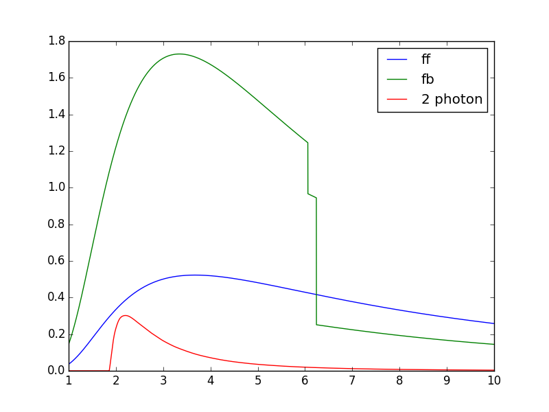

In the continuum calculations, the specified ion, Fe XXV in this case, is the target ion for the free-free calculation.  For the free-bound calculation, specified ion is also the target ion.  In this case, the radiative recombination spectrum of Fe XXV recombining to form Fe XXIV is returned.

The multi-ion class Bunch
-------------------------

The multi-ion class **bunch** [new in v0.6] inherits a number of the same methods inherited by the ion class, for example *intensityList*, *intensityRatio*, and *intensityRatioSave*. As a short demonstration of its usefulness, Widing and Feldman (1989, ApJ, 344, 1046) used line ratios of Mg VI and Ne VI as diagnostics of elemental abundance variations in the solar atmosphere. For that to be accurate, it is necessary that the lines of the two ions have the same temperature response.

::

  t = 10.**(5.0+0.1*np.arange(11))
  bnch=ch.bunch(t,1.e+9,wvlRange=[300.,500.],ionList=['ne_6','mg_6'],abundance='unity')
  bnch.intensityRatio(wvlRange=[395.,405.],top=7)

produces and initial plot of the selected lines, a selection widget and finally a plot of the ratio

.. image:: _static/ne6_mg6_t_ratio_top7.png
    :align:  center

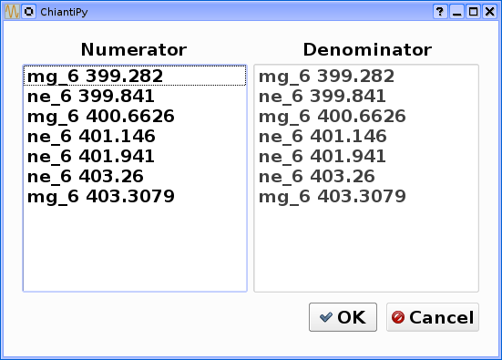

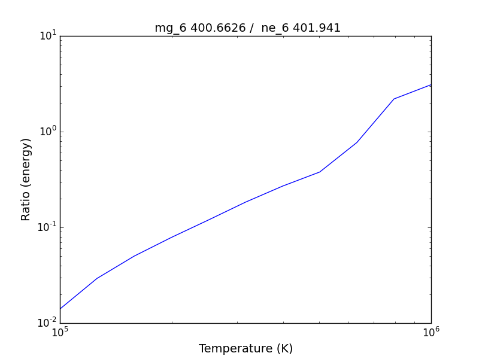

there seems to be a significant temperature dependence to the ratio, even though both are formed near 4.e+5 K.

A new keyword argument **keepIons** has been added in v0.6 to the bunch and the 3 spectrum classes.

::

  dwvl = 0.01
  nwvl = (406.-394.)/dwvl
  wvl = 394. + dwvl*np.arange(nwvl+1)
  bnch2=ch.bunch(t, 1.e+9, wvlRange=[wvl.min(),wvl.max()], elementList=['ne','mg'], keepIons=1,em=1.e+27)
  bnch2.convolve(wvl,filter=(chfilters.gaussian,5.*dwvl))
  plt.plot(wvl, bnch2.Spectrum['intensity'][6],label='Total')
  plt.title('Temperature = %10.2e for t[6]'%(t[6]))

elapsed seconds =       11.000
elapsed seconds =    0.000e+00

::

  for one in sorted(bnch2.IonInstances.keys()):
    print('%s'%(one))

yields:

mg_10
mg_10d
mg_3
mg_4
mg_5
mg_6
mg_8
mg_9
ne_10
ne_2
ne_3
ne_5
ne_6
ne_8

these IonInstances have all the properties of the Ion class for each of these ions

::

  plt.plot(wvl,bnch2.IonInstances['mg_6'].Spectrum['intensity'][6],'r',label='mg_6')
  plt.legend(loc='upper left')

produces

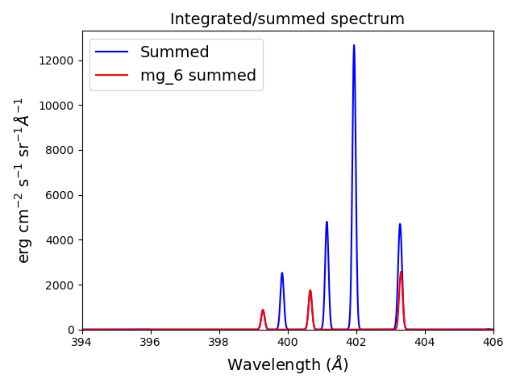

Spectra of multiple ions and continuum
--------------------------------------

the spectrum for all ions in the CHIANTI database can also be calculated

The spectrum for a selection of all of the ions in the CHIANTI database can also be calculated. There are 3 spectral classes.

*  **spectrum** - the single processor implementation that can be used anywhere
*  **mspectrum** - uses the Python multiprocessing class and cannot be used in a IPython qtconsole or notebook
*  **ipymspectrum** [new in v0.6] - uses the IPython parallel class and can be used in a IPython qtconsole or notebook

The single processor spectrum class
===================================

::

  temperature = [1.e+6, 2.e+6]
  density = 1.e+9
  wvl = 200. + 0.05*arange(2001)
  emeasure = [1.e+27 ,1.e+27]
  s = ch.spectrum(temperature, density, wvl, filter = (chfilters.gaussian,.2), em = emeasure, doContinuum=0, minAbund=1.e-5)
  subplot(311)
  plot(wvl, s.Spectrum['integrated'])
  subplot(312)
  plot(wvl, s.Spectrum['intensity'][0])
  subplot(313)
  plot(wvl, s.Spectrum['intensity'][1])

produces

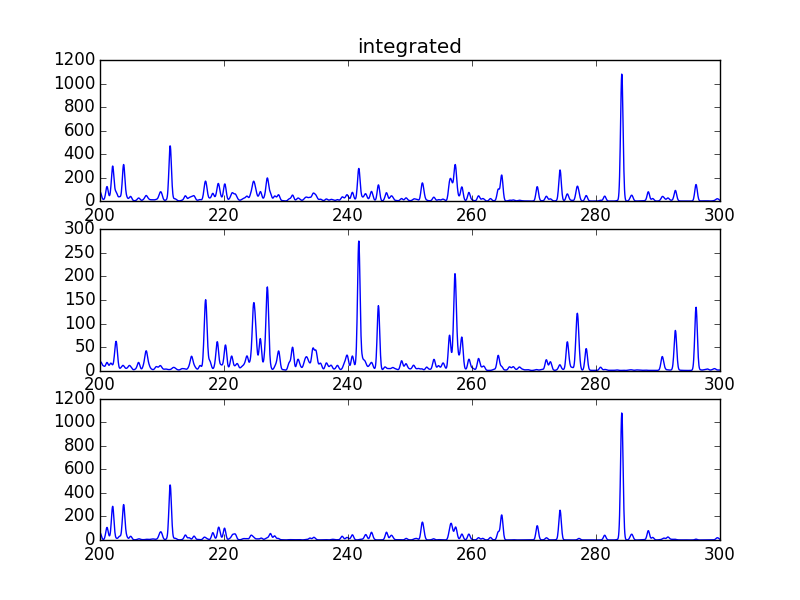

The integrated spectrum is formed by summing the spectra for all temperatures.

  * For minAbund=1.e-6, the calculatation takes 209 s on a 3.5 GHz processor.

  * For minAbund=1.e-5, the calculatation takes 122 s on a 3.5 GHz processor.

The filter is not applied to the continuum.

Calculations with the Spectrum module can be time consuming.  One way to control the length of time the calculations take is to limit the number of ions with the ionList keyword and to avoid the continuum calculations by setting the doContinuum keyword to 0 or False.  Another way to control the length of time the calculations take is with the minAbund keyword.  It sets the minimum elemental abundance that an element can have for its spectra to be calculated.  The default value is set include all elements.  Some usefull values of minAbund are:

  * minAbund = 1.e-4, will include H, He, C, O, Ne

  * minAbund = 2.e-5 adds  N, Mg, Si, S, Fe

  * minAbund = 1.e-6 adds  Na, Al, Ar, Ca, Ni

The multiple processor mspectrum class
======================================

Another way to speed up calculations is to use the *mspectrum* class which uses multiple cores on your local computer.  It requires the Python *multiprocessing* module which is available with Python versions 2.6 and later. *mspectrum* is called in the same way as *spectrum* but you can specify the number of cores with the *proc* keyword.  The default is 3 but it will not use more cores than are available on your machine.  For example,

::

  s = ch.mspectrum(temperature, density ,wvl, em=emeasure, filter = (chfilters.gaussian,.005), proc=4)

The multiple processor ipymspectrum class
=========================================

next, we will use the ipymspectrum class.  First, it is necessary to start up the cluster.  In some shell

> ipcluster start   --n=4

or, if you are using Python3

> ipcluster3 start --n=4

this will start 4 engines if you have 4 cores but it won't start more than you have

then in an IPython notebook or qtconsole

::

  temp = [1.e+6, 2.e+6]
  dens = 1.e+9
  wvl = 200. + 0.05*np.arange(2001)
  emeasure = [1.e+27 ,1.e+27]
  s = ch.ipymspectrum(temp, dens, wvl, filter = (chfilters.gaussian,.2), em = emeasure, doContinuum=1, minAbund=1.e-5, verbose=0)
  plt.figure
  plt.plot(wvl, s.Spectrum['integrated'])

produces

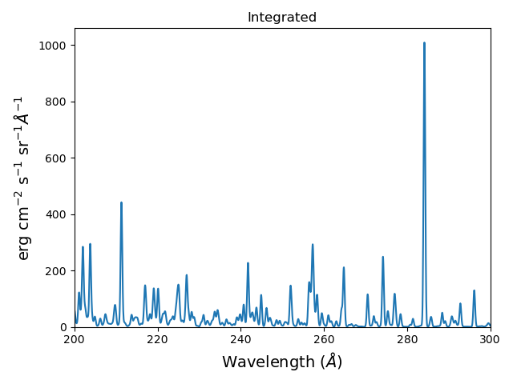

spectrum, mspectrum and ipymspectrum can all be instantiated with the same arguments and keyword arguments.  Most of the examples below use the ipymspectrum class for speed.

::

  temperature = 1.e+7
  wvl = 10. + 0.005*arange(2001)
  s = ch.ipymspectrum(temperature, density, wvl, filter = (chfilters.gaussian,.015))
  plot(wvl, s.Spectrum['intensity'])

produces

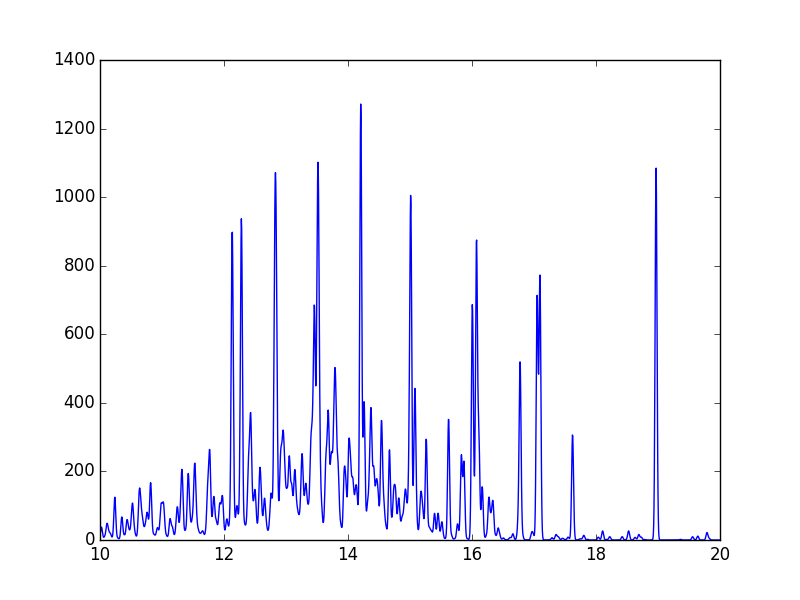

It is also possible to specify a selection of ions by means of the *ionList* keyword, for example, *ionList=['fe_11','fe_12','fe_13']*

::

  s2 = ch.ipymspectrum(temp, dens, wvl, filter = (chfilters.gaussian,.2), em = emeasure, doContinuum=0, keepIons=1, elementList=['si'], minAbund=1.e-4)
  plt.subplot(211)
  plt.plot(wvl,s2.Spectrum['intensity'][0])
  plt.ylabel(r'erg cm$^{-2}$ s$^{-1}$ sr$^{-1} \AA^{-1}$')
  plt.subplot(212)
  plt.plot(wvl,s2.IonInstances['si_9'].Spectrum['intensity'][0])
  plt.ylabel(r'erg cm$^{-2}$ s$^{-1}$ sr$^{-1} \AA^{-1}$')
  plt.xlabel(r'Wavelength ($\AA$)')
  plt.title('Si IX')

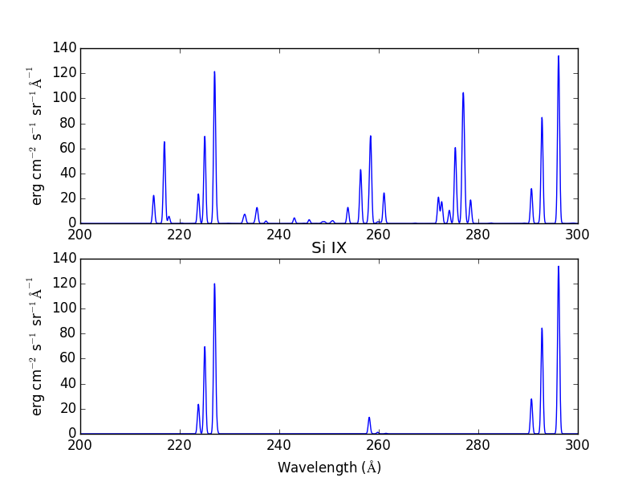

Because **keepIons** has been set, the ion instances of all of the ions are maintained in the s2.IonInstances dictionary. It has been possible to compare the spectrum of all of the ions with the spectrum of a single ion.

::

  temp=2.e+7
  dens=1.e+9
  wvl = 1. + 0.002*np.arange(4501)
  s3 = ch.ipymspectrum(temp, dens, wvl, filter = (chfilters.gaussian,.015),doContinuum=1, em=1.e+27,minAbund=1.e-5,verbose=0)
  plt.plot(wvl, s3.Spectrum['intensity'])

.. image:: _static/spectrum_1_10.png
    :align:  center

with doContinuum=1, the continuum can be plotted separately

::

  plot(wvl, s3.Spectrum['intensity'])  plot(wvl,s.FreeFree['intensity'])
  plot(wvl,s.FreeBound['intensity'])
  plot(wvl,s.FreeBound['intensity']+s.FreeFree['intensity'])

produces

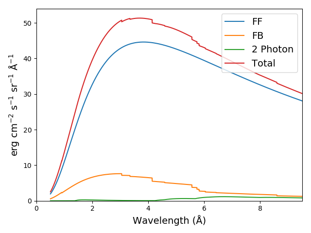

::

  temperature = 2.e+7
  density = 1.e+9
  em-1.e+27
  wvl = 1.84 + 0.0001*arange(601)
  s4 = ch.ipymspectrum(temperature, density ,wvl, filter = (chfilters.gaussian,.0003), doContinuum=1, minAbund=1.e-5, em=em, verbose=0)

produces

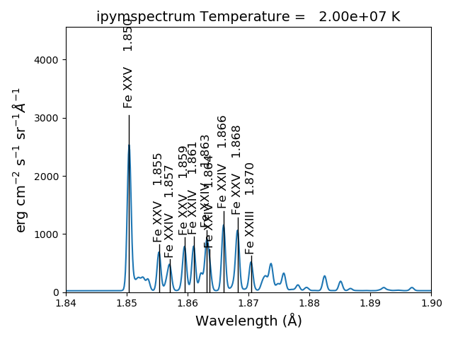

Radiative loss rate
-------------------

the radiative loss rate can be calculated as a function of temperature and density:

::

  temp = 10.**(4.+0.05*arange(81))
  rl = ch.radLoss(temp, 1.e+4, minAbund=2.e-5)
  rl.radLossPlot()

produces, in 446 s:

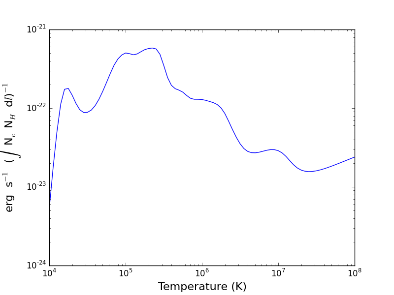

the radiative losses are kept in the rl.RadLoss dictionary

the **abundance** keyword argument can be set to the name of an available abundance file in XUVTOP/abund

if abundance='abc', or some name that does not match an abundance name, a dialog will come up so that a abundance file can be selected
