===========
Quick Start
===========

This short tutorial will demonstrate some of the capabilities of ChiantiPy and the CHIANTI database.  It assumes that you know what the CHIANTI database provides and why you want to use it.  It is useful to begin by exploring the properties of the **ion class**, as much of ChiantiPy is based on it.  An ion such as Fe XIV is specified by the string 'fe_14', in the usual CHIANTI notation.

Perhaps the easiest way is to use a jupyter-notebook is to load the quick start notebook file QuickStart.ipynb in the directory jupyter_notebooks.  Then, just run each cell step by step.  If you are not familiar with notebooks, then you can cut and paste the following code into a Python/IPython session.

N.B.:  in the time some of the plots and data were produced, there have been some changes to ChiantiPy and CHIANTI.  It is possible that you might find differences (hopefully small).

Bring up a Python session (using > Python -i ), or better yet, an IPython session

::

  import os

the following will show the XUVTOP directory

::

  os.environ['XUVTOP']

::

  import ChiantiPy
  import ChiantiPy.core as ch
  import ChiantiPy.tools.filters as chfilters
  import ChiantiPy.tools.io as chio
  import numpy as np
  import matplotlib.pyplot as plt

::

  matplotlib qt

::

  autoreload 2

to see the ChiantiPy version

::

  ChiantiPy.__version__

to see the Ipython version

::

  import IPython
  print(' IPython version = %i.%i.%i'%(IPython.version_info[0],IPython.version_info[1],IPython.version_info[2]))

It is useful to open a qtconsole where are the calculations can be easily examined

::

  qtconsole

to see the version of the CHIANTI database

::

  chianti_version = chio.versionRead()

::

  chianti_version

Setting default values
----------------------

ChiantiPy determines a number of default setting on instantiation.  To use the default values list below, it is not necssary to do anything.

==========  ===========================  =====================
setting     default                      possible values
==========  ===========================  =====================
wavelength  angstrom                     angstrom, nm, ev, kev
flux        energy                       energy, photon
abundfile   sun_photospheric_2015_scott  any.abund
ioneqfile   chianti                      any.ioneq
==========  ===========================  =====================

to use any of the other possible values, check out the notes/setting_default_values in the documentation

the defaults can be checked

::

  chdata.Defaults.keys()

::

  chdata.Defaults['wavelength']

Level populations
-----------------

As a start, we will examine the various properties of the Fe XIV emissivities as a function of temperature and density.  So, let's define a numpy array of temperatures

::

  temp = 10.**(5.8 + 0.05*np.arange(21.))

In ChiantiPy, temperatures are currently given in degrees Kelvin and densities as the number electron density per cubic cm.  Then, construct fe14 as would be typically done

::

  fe14 = ch.ion('fe_14', temperature=temp, eDensity=1.e+9, em=1.e+27)

note that eDensity is the new keyword for electron density

::

  fe14.popPlot(addLegend=False)

produces a matplotlib plot window were the population of the top 10 (the default) levels are plotted as a function of temperature.

.. image::  _static/fe14.popplot.png
    :align:  center

If the level populations had not already been calculated, popPlot() would have invoked the populate() method which calculates the level populations and stores them in the Population dictionary, with keys = ['protonDensity', 'population', 'temperature', 'density'].

A ChiantiPy Convention
----------------------

Classes and function of ChiantiPy start with lower case letters.  Data/attributes that are attached to the instantiation of a class will start with a capital letter.  For example,

::

  fe14.populate() creates fe14.Population containing the level population information

  fe14.intensity() created fe14.Intensity contain the line intensities information

  fe14.spectrum() creates fe14.Spectrum contain the line and continuum spectrum information

Spectral Line Intensities
-------------------------

::

  fe14.intensityPlot(wvlRange=[210.,220.])

will plot the intensities for the top (default = 10) lines in the specified wavelength range.  If the **Intensity** attribute has not yet been calculated, it will calculate it.  Since there are 21 temperature involved, a single temperature is selected (21//2 = 10).  Otherwise,

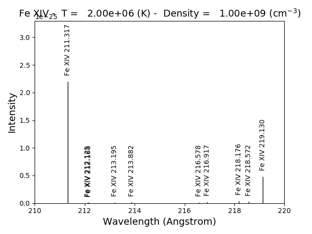

::

  fe14.intensityPlot(index=10, wvlRange=[210., 220.], relative=True)

plots the intensities for a temperature = t[10] = 2.e+6, in this case.  And, by specifying relative = True, the emissivities will be plotted relative to the strongest line.

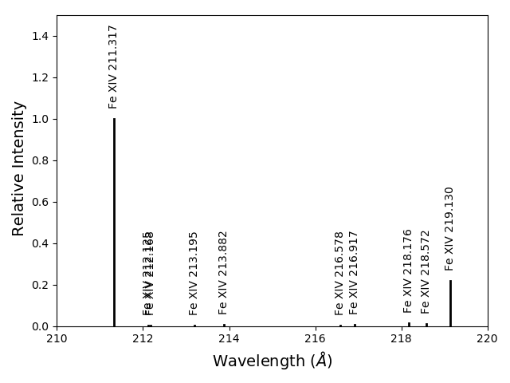

::

  fe14.intensityPlot(index=10, wvlRange=[210., 220.], relative=True, doTitle=False, lw=2)

plots the intensities for a temperature = t[10] = 2.e+6, in this case.  And, by specifying relative = True, the emissivities will be plotted relative to the strongest line, doTitle=False, stops the title from appearing and lw sets the line width to 2.

.. image:: _static/fe14_intensity_plot_lin_index10_rel_notitle.png
    :align:  center

::

  fe14.intensityList(wvlRange=[200,220], index=10)

gives the following terminal output:

::

  using index =    10 specifying temperature =   2.00e+06, eDensity =    1.00e+09 em =   1.00e+27

  ------------------------------------------

  Ion  lvl1  lvl2                     lower - upper                           Wvl(A)    Intensity      A value Obs
  fe_14     1    11              3s2.3p 2P0.5 - 3s2.3d 2D1.5                  211.3172    2.336e+02     3.81e+10 Y
  fe_14     4    27              3s.3p2 4P1.5 - 3s.3p(3P).3d 4P1.5            212.1255    5.355e-01     2.21e+10 Y
  fe_14     4    28              3s.3p2 4P1.5 - 3s.3p(3P).3d 4D2.5            212.1682    4.039e-01     1.15e+10 Y
  fe_14     3    24              3s.3p2 4P0.5 - 3s.3p(3P).3d 4D0.5            213.1955    8.073e-01     4.26e+10 Y
  fe_14     3    23              3s.3p2 4P0.5 - 3s.3p(3P).3d 4D1.5            213.8822    1.393e+00     2.97e+10 Y
  fe_14     5    28              3s.3p2 4P2.5 - 3s.3p(3P).3d 4D2.5            216.5786    9.736e-01     2.83e+10 Y
  fe_14     5    25              3s.3p2 4P2.5 - 3s.3p(3P).3d 4D3.5            216.9173    1.730e+00     4.29e+10 Y
  fe_14     7    32              3s.3p2 2D2.5 - 3s.3p(3P).3d 2F3.5            218.1767    3.734e+00     1.70e+10 Y
  fe_14     4    22              3s.3p2 4P1.5 - 3s.3p(3P).3d 4P2.5            218.5725    2.391e+00     2.65e+10 Y
  fe_14     2    12              3s2.3p 2P1.5 - 3s2.3d 2D2.5                  219.1305    5.077e+01     4.27e+10 Y

 ------------------------------------------

optionally, an output file could also be created by setting the keyword outFile to the name of the desired name

::

  fe14.intensityList(wvlRange=[210.,220.], relative=1, index=11)

give the following terminal/notebook output

::

  using index =    11 specifying temperature =   2.24e+06, eDensity =    1.00e+09 em =   1.00e+27

  ------------------------------------------

  Ion  lvl1  lvl2                     lower - upper                           Wvl(A)    Intensity      A value Obs
  fe_14     1    11              3s2.3p 2P0.5 - 3s2.3d 2D1.5                  211.3172    1.000e+00     3.81e+10 Y
  fe_14     4    27              3s.3p2 4P1.5 - 3s.3p(3P).3d 4P1.5            212.1255    2.267e-03     2.21e+10 Y
  fe_14     4    28              3s.3p2 4P1.5 - 3s.3p(3P).3d 4D2.5            212.1682    1.694e-03     1.15e+10 Y
  fe_14     3    24              3s.3p2 4P0.5 - 3s.3p(3P).3d 4D0.5            213.1955    3.390e-03     4.26e+10 Y
  fe_14     3    23              3s.3p2 4P0.5 - 3s.3p(3P).3d 4D1.5            213.8822    5.891e-03     2.97e+10 Y
  fe_14     5    28              3s.3p2 4P2.5 - 3s.3p(3P).3d 4D2.5            216.5786    4.083e-03     2.83e+10 Y
  fe_14     5    25              3s.3p2 4P2.5 - 3s.3p(3P).3d 4D3.5            216.9173    7.085e-03     4.29e+10 Y
  fe_14     7    32              3s.3p2 2D2.5 - 3s.3p(3P).3d 2F3.5            218.1767    1.557e-02     1.70e+10 Y
  fe_14     4    22              3s.3p2 4P1.5 - 3s.3p(3P).3d 4P2.5            218.5725    1.009e-02     2.65e+10 Y
  fe_14     2    12              3s2.3p 2P1.5 - 3s2.3d 2D2.5                  219.1305    2.096e-01     4.27e+10 Y

 ------------------------------------------

The effect of electron density on line intensities
--------------------------------------------------

::

  temp = 2.e+6
  dens = 10.**(6. + 0.1*np.arange(61))
  fe14 = ch.ion('fe_14', temp, dens)
  fe14.popPlot()

a plot of the population of the top 10 levels is produced as a function of the electron density

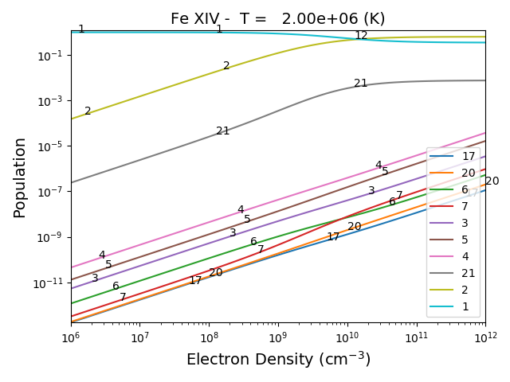

G(n,T) function
---------------

::

  temp = 10.**(5.8 + 0.05*np.arange(21.))
  dens = 1.e+9
  fe14 = ch.ion('fe_14', temp, dens)

::

  fe14.gofnt(wvlRange=[210., 220.],top=3)

brings up a matplotlib plot window which shows the emissivities of the top (strongest) 3 lines in the wavelength region from 210 to 220 Angstroms.

.. image:: _static/fe14.rel.emiss.png
    :align:  center

quickly followed by a dialog where the line(s) of interest can be specified

.. image:: _static/fe14.gofnt.selector.png
    :align:  center

and finally a plot of the G(n,T) function for the specified lines(s).

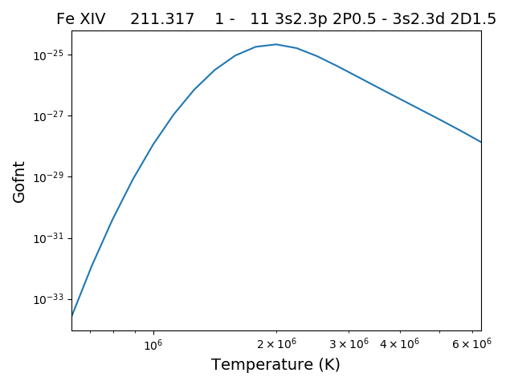

The G(n,T) calculation is stored in the Gofnt dictionary, with keys = ['gofnt', 'temperature', 'density']

while the is a fairly straightforward way to get a G(T) function, it is not very practical to use for a more than a handful of lines. For if the fe_14 line at 211.3172 is in a list of lines to be analyzed, a more practical way is the following

::

  fe14.intensity()
  dist = np.abs(np.asarray(fe14.Intensity['wvl']) - 211.3172)
  idx = np.argmin(dist)
  print(' wvl = %10.3f '%(fe14.Intensity['wvl'][idx]))

prints

wvl =    211.317

::

  plt.loglog(temp,fe14.Intensity['intensity'][:,idx])

once the axes are properly scaled, this produces the same values as fe14.Gofnt['gofnt']

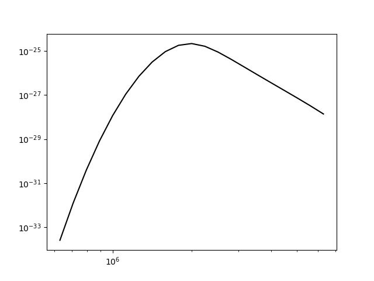

Ionization Equilibrium
----------------------

For the Fe XIV example, the temperature was chosen to center around 2.e+6.  It was not immediately apparent why this was done but in most of the following examples it is necessary to pick an appropriate temperature.  This can be done with the **ioneq** class.  To look at the ionization equilibrium for the iron ions (Z = 26, or 'fe')

::

  fe = ch.ioneq(26)
  fe.load()
  fe.plot()
  plt.tight_layout()

brings up a plot showing the ionization equilibrium for all of the stages of iron as a function of temperature

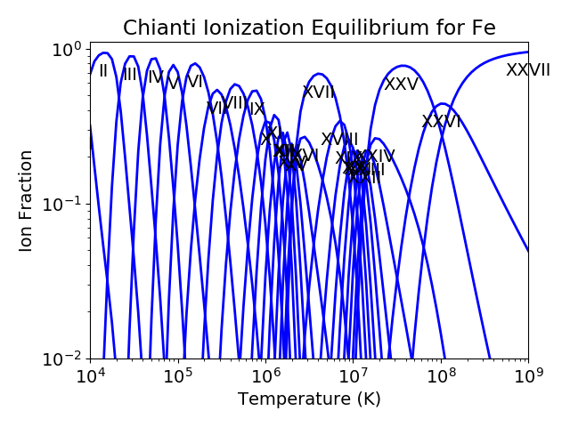

This is pretty crowded and we are only interested in Fe XIV (fe_14), so

::

  plt.figure()
  fe.plot(stages=[13,14,15],tRange=[1.e+6, 6.e+6], yr = [1.e-2, 0.4])
  plt.tight_layout()

produces a plot of the ionization equilibria of Fe XIII, XIV and XV over a limited temperature range (tRange) and vertical range (yr)

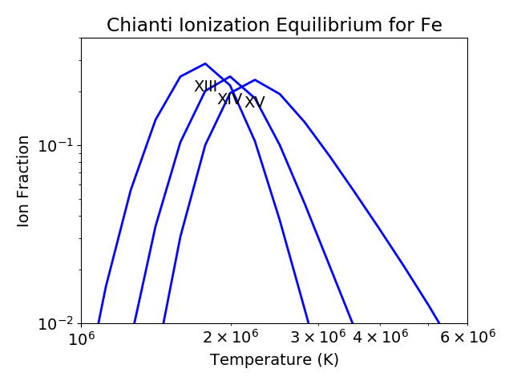

from this it is clear that Fe XIV (fe_14) is formed at temperatures near :math:`2 \times 10^6` K

Intensity Ratios
----------------

::

  temp = 10.**(5.8 + 0.05*np.arange(21.))
  dens = 1.e+9

::

  fe14 = ch.ion('fe_14', temperature = temp, eDensity = dens)

::

  fe14.intensityRatio(wvlRange=[210., 225.])

this brings up a plot showing the relative emissivities on the Fe XIV lines

.. image:: _static/fe14.int.vs.t.png
    :align:  center

following by a dialog where you can selector the numerator(s) and denominator(s) of the desired intensity ratio

.. image:: _static/2.selector.png
    :align:  center

so the specified ratio is then plotted

.. image:: _static/fe14.int.ratio.vs.t.png
    :align:  center

if previously, we had done

::

  dens = 10.**(6. + 0.1*arange(61))
  fe14 = ch.ion('fe_14', 2.e+6, dens)
  fe14.intensityRatio(wvlRange=[210., 225.])

then the plot of relative intensities vs density would appear

.. image:: _static/fe14.int.vs.d.png
    :align:  center

the same numerator/denominator selector dialog would come up and when 2 or more lines are selected, the intensity ratio versus density appears.

.. image:: _static/fe14.int.ratio.vs.d.png
    :align:  center

to obtain ratios of lines widely separated in wavelength, the wvlRanges keyword can be used:

::

 fe12 = ch.ion('fe_12', temperature=t, eDensity=1.e+9
 fe12.intensityRatio(wvlRanges=[[190.,200.],[1240.,1250.]])

.. image:: _static/fe_12_wvlranges_ratio.png
    :align:  center

Spectra of a single ion
-----------------------

::

  fe14 = ch.ion('fe_14', temperature = 2.e+6, density = 1.e+9)

::

  wvl = wvl=200. + 0.125*arange(801)

::
  fe14.spectrum(wvl, em=1.e+27)

::

  plt.figure()
  plt.plot(wvl, fe14.Spectrum['intensity'])
  xy = plt.axis()
  xy

::

  plt.axis([200., 300., 0., 400.])
  plt.xlabel(fe14.Spectrum['xlabel'], fontsize=14)
  plt.ylabel(fe14.Spectrum['ylabel'], fontsize=14)
  plt.tight_layout()

this will calculate the spectrum of fe_14 over the specified wavelength range and filter it with the default filter which is a gaussian (filters.gaussianR) with a 'resolving power' of 1000 which gives a gaussian width of wvl/1000.

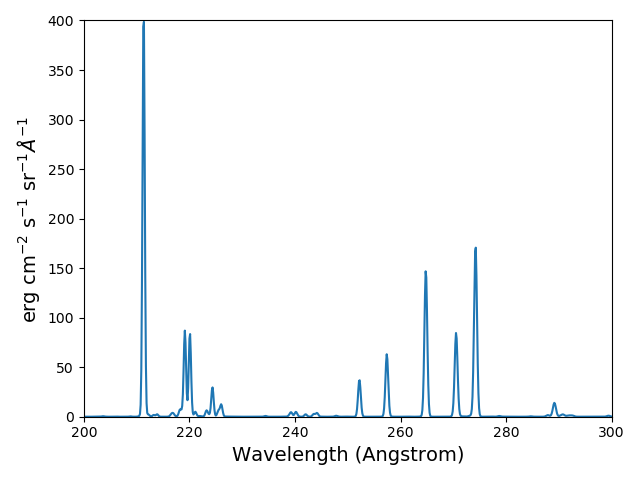

other filters available in chianti.tools.filters include a boxcar filter and a gaussian filter where the width can be specified directly

::

  if hasattr(fe14,'Em'):
      print(' Emission Measure = %12.2e'%(fe14.Em))
  else:
      print(' the value for the emission measure is unspecified')

Emission Measure =     1.00e+27

::

  import chianti.tools.filters as chfilters
  fe14.spectrum(wvl,filter=(chfilters.gaussian,.04))

calculates the spectrum of fe_14 for a gaussian filter with a width of 0.04 Angstroms.
The current value of the spectrum is kept in fe14.Spectrum with the following keys:

::

  for akey in sorted(fe14.Spectrum.keys()):
      print(' %10s'%(akey))

allLines
em
filter
filterWidth
intensity
wvl
xlabel
ylabel

::

  plot(wvl,fe14.Spectrum['intensity'])
  plt.xlabel(fe14.Spectrum['xlabel'])
  plt.ylabel(fe14.Spectrum['ylabel'])

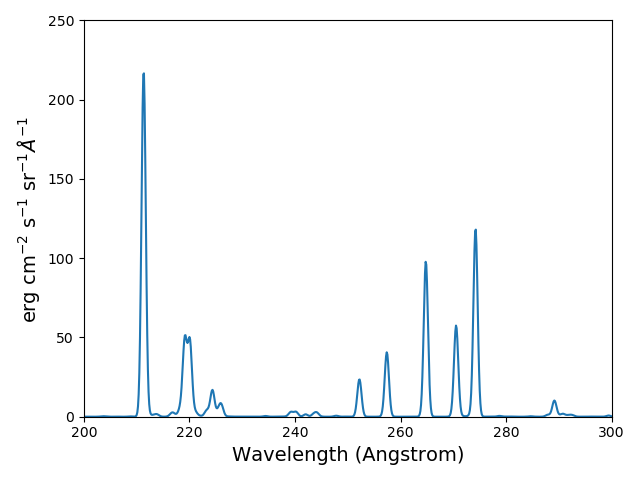

As of **ChiantiPy 0.14.0**, the **ion** class inherits the spectrumPlot method.

::

  wvlRange = [wvl[0], wvl[-1]
  fe14.spectrumPlot(wvlRange=wvlRange, index=5)

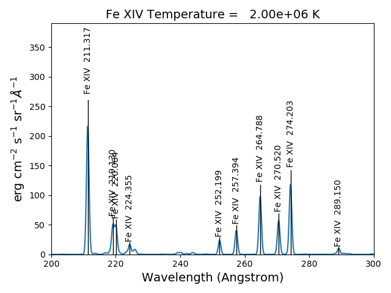

Also in 0.14.0 is the saveData method and the redux class.  Using the **saveData** method, the calculations can be save and the restored later with the **redux** class

::

  saveName = 'fe14_save.pkl'
  fe14.saveData(saveName, verbose=True)

the attributes are used to create a dict and saved as a pickle file.  If verbose is set to True, these attributes are listed

::

    with open(saveName,'rb') as inpt:
        fe14Dict = pickle.load(inpt)

::

  for akey in fe14Dict:
    print(' key = %s'%(akey))

::

  for akey in fe14Dict['Spectrum']:
      print(' key = %s'%(akey))

it is possible to work directly with the saved data

::

  plt.figure()
  plt.plot(fe14Dict['Spectrum']['wavelength'], fe14Dict['Spectrum']['intensity'])

with version 0.14.0, there is a new class, **redux**

with this class, the saved data can be restored and all of the apprpriated inherited methods are available

::

  rdx = ch.redux(saveName, verbose=True)

The save data are loaded as attributes.  With verbose=True, they are listed

::

  rdx.spectrumPlot(wvlRange=wvlRange, index=5)

Returns the previous plot

New in **ChiantiPy 0.6**, the *label* keyword has been added to the ion.spectrum method, and also to the other various spectral classes. This allows several spectral calculations for different filters to be saved and compared.  However, when the *label* keyword is specified, the intensityPlot and spectrumPlot methods do not work, as of version 0.14.0

::

  temp = 10.**(5.8 + 0.1*np.arange(11.))
  dens = 1.e+9
  fe14 = ch.ion('fe_14', temp, dens)
  emeas = np.ones(11,'float64')*1.e+27
  wvl = 200. + 0.125*np.arange(801)
  fe14.spectrum(wvl,filter=(chfilters.gaussian,.4),label='.4',em=emeas, label='0.4')
  fe14.spectrum(wvl,filter=(chfilters.gaussian,1.),label='1.', label-'1.0')
  plt.plot(wvl,fe14.Spectrum['.4']['intensity'][5])
  plt.plot(wvl,fe14.Spectrum['1.']['intensity'][5],'-r')
  plt.xlabel(fe14.Spectrum['.4']['xlabel'])
  plt.ylabel(fe14.Spectrum['.4']['ylabel'])
  plt.legend(loc='upper right')
  plt.tight_layout()

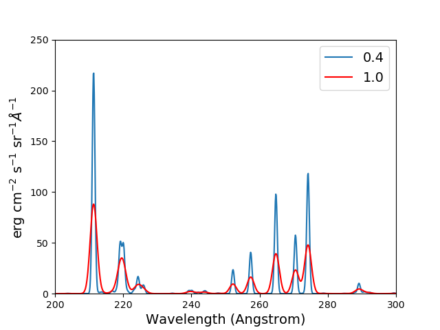

Using emission measures (EM)
----------------------------

the line-of-sight emission measure is given by :math:`\mathrm{\int \, n_e \, n_H \, dl}` (:math:`\mathrm{cm}^{-5}`)

the volumetric emission measure is give by :math:`\mathrm{\int \, n_e \, n_H \, dV}` (:math:`\mathrm{cm^{-3}}`)

where the integrations are performed over the source region

::

  emDir = os.path.join(os.environ['XUVTOP'], 'em')
  emList = os.listdir(emDir)
  for idx, emFile in enumerate(emList):
    print('%i  %s'%(idx, emFile))

the following is printed

| 0  quiet_sun_1993_serts_4T.em
| 1  active_region_1993_serts_4T.em

Beginning with CHIANTI version 10, a new directory, em, as been added to contain emission measure files.

At this time, there only 2 files available and we can pick the active region file

::

  arDict = chio.emRead(emList[1])
  arDict.keys()

dict_keys(['temperature', 'density', 'em', 'ref', 'filename'])

::

  arTemp = arDict['temperature']
  arDens = arDict['density']
  arEm = arDict['em']

::

  for idx, atemp in enumerate(arTemp):
      print('%i %10.2e %10.2e %10.2e'%(idx, atemp, arDens[idx], arEm[idx]))

| 0   6.17e+05   2.00e+09   4.97e+26
| 1   1.12e+06   2.00e+09   2.09e+27
| 2   1.86e+06   2.00e+09   7.89e+27
| 3   3.16e+06   2.00e+09   1.46e+28

::

  fe14  = ch.ion('fe_14', arTemp, arDens, em=arEm)
  wvl = np.linspace(200., 300., 10001)
  fe14.spectrum(wvl, filter=(chfilters.gaussian, .03))
  fe14.spectrumPlot(wvlRange=[264., 275.], integrated=True, top=5)

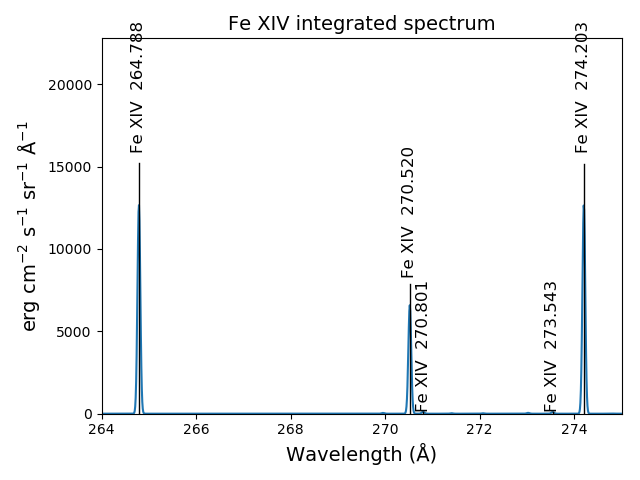

Free-free and free-bound continuum
----------------------------------

The module continuum provides the ability to calculate the free-free and free-bound spectrum for a large number of  individual ions.  The two-photon continuum is produced only by the hydrogen-like and helium-like ions

::

  myIon = 'fe_25'

::

  temperature = [2.e+7, 3.e+7, 6.e+7]
  density = 1.e+9
  em = [1.e+27, 1.e+27, 1.e+27]
  wvl = 0.5 + 0.002*np.arange(4501)

::

  c = ch.continuum(myIon, temperature = temperature, em=em)
  c.freeFree(wvl)
  c.freeBound(wvl)
  fe25=ch.ion(myIon, temperature, density, em=em)
  fe25.twoPhoton(wvl)
  total = c.FreeFree['intensity'][itemp] + c.FreeBound['intensity'][itemp] + fe25.TwoPhoton['intensity'][itemp]

::

  itemp = 1
  plt.figure()
  plt.plot(wvl, c.FreeFree['intensity'][itemp],label='ff')
  plt.plot(wvl, c.FreeBound['intensity'][itemp],label='fb')
  plt.plot(wvl,fe25.TwoPhoton['intensity'][itemp],label='2 photon')
  plt.plot(wvl, total, 'k', label='total')
  plt.xlabel(c.FreeFree['xlabel'], fontsize=14)
  plt.ylabel(c.FreeFree['ylabel'], fontsize=14)
  plt.legend(loc='upper right', fontsize=14)
  plt.title(' %s  T = %10.2e'%(fe25.IonStr, temperature[itemp]), fontsize=14)
  plt.ylim(bottom=0.)
  plt.xlim([0., wvl[-1]])
  plt.tight_layout

produces

.. image:: _static/fe_25_ff_fb_tp_2e7_1_10.png
    :align:  center

::

  myIon = 'o_8'

::

  temperature = [3.e+6, 6.e+6]
  density = 1.e+9
  em = [2.e+27,1.e+27]
  wvl = 2. + 0.2*np.arange(701)

::

  c = ch.continuum(myIon, temperature = temperature, em=em)
  c.freeFree(wvl)
  c.freeBound(wvl)
  o8 = ch.ion(myIon, temperature, density, em=em)
  o8.twoPhoton(wvl)
  total = c.FreeFree['intensity'][itemp] + c.FreeBound['intensity'][itemp] + o8.TwoPhoton['intensity'][itemp]

::

  itemp = 1
  plt.figure()
  plt.semilogy(wvl, c.FreeFree['intensity'][index],label='ff')
  plt.semilogy(wvl, c.FreeBound['intensity'][index],label='fb')
  plt.semilogy(wvl,o8.TwoPhoton['intensity'][index],label='2 photon')
  plt.plot(wvl, total[itemp], 'k', label='total')
  plt.ylim(bottom=1.e-4, top=1.)
  plt.xlabel(c.FreeFree['xlabel'], fontsize=14)
  plt.ylabel(c.FreeFree['ylabel'], fontsize=14)
  plt.title(' %s  T = %10.2e'%(o8.IonStr, temperature[itemp]), fontsize=14)
  plt.legend(loc='upper right', fontsize=14)
  plt.tight_layout()

produces

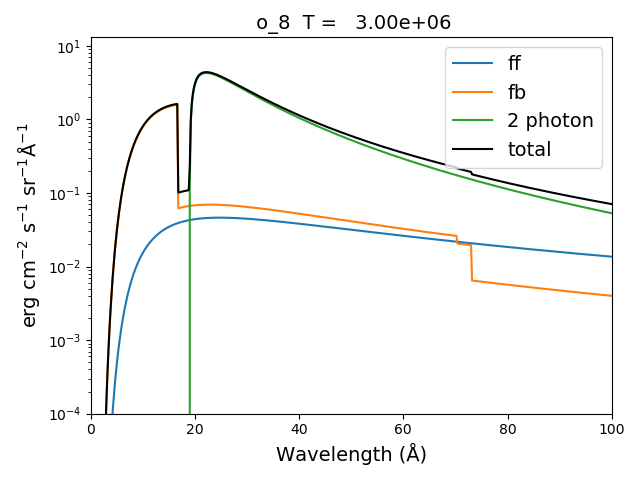

In the continuum calculations, the specified ion, Fe XXV in this case, is the target ion for the free-free calculation.  For the free-bound calculation, specified ion is also the target ion.  In this case, the radiative recombination spectrum of Fe XXV recombining to form Fe XXIV is returned.

The multi-ion class Bunch
-------------------------

The multi-ion class **bunch** [new in v0.6] inherits a number of the same methods inherited by the ion class, for example *intensityList*, *intensityRatio*, and *intensityRatioSave*. As a short demonstration of its usefulness, Widing and Feldman (1989, ApJ, 344, 1046) used line ratios of Mg VI and Ne VI as diagnostics of elemental abundance variations in the solar atmosphere. For that to be accurate, it is necessary that the lines of the two ions have the same temperature response.

::

  temp = 10.**(5.0+0.1*np.arange(11))
  dens = 1.e+9
  wvlRange = [wvl.min(),wvl.max()]

::

  bnch=ch.bunch(temp, 1.e+9, wvlRange=wvlRange, ionList=['ne_6','mg_6'], abundance='unity', em=1.e+27)
  bnch.intensityRatio(wvlRange=[395.,405.], top=7)

produces and initial plot of the selected lines, a selection widget and finally a plot of the ratio

.. image:: _static/ne6_mg6_t_ratio_top7.png
    :align:  center

.. image:: _static/bunch_selector.png
    :align:  center

.. image:: _static/ne6_mg6_t_ratio.png
    :align:  center

there seems to be a significant temperature dependence to the ratio, even though both are formed near 4.e+5 K.

The intensityPlot method can also be used with the bunch class

::

  bnch.intensityPlot(index=5, wvlRange=[398., 404.])

results in

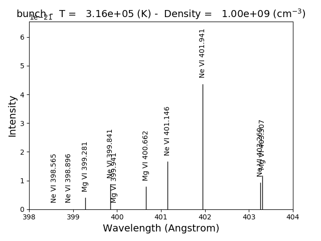

with version 0.13.0 it is possible to save multi-ion calculations as a pickle file with the saveData method

::

  dataName = 'mybunch.pkl'
  bnch.saveData(dataName, verbose=True)

the saveData method creates a dict of all of the attributes of the bnch instance.  The pickle file can be loaded an it is possible to work directly with the data.

::

  with open(dataName, 'rb') as inpt:
      mybnch = pickle.load(inpt)

::

  mybnch.keys()

::

  mybnch['Intensity']['intensity'].shape

with version 0.14.1, the redux class is introduced to allow the use of the pickled data inside a class that inherits such methods as intensityPlot and spectrumPlot

::

    rebnch = ch.redux(dataName, verbose=False)

::

    rebnch.intensityPlot(index=5, wvlRange=[398., 404.])

then returns the above plot

A new keyword argument **keepIons** has been added in v0.6 to the bunch and the 3 spectrum classes.  It should be used with some care as it can lead to very large instances in the case of a large number of ions, temperature, or densities.

::

  temp = 10.**(5.0+0.2*np.arange(6))
  dens = 1.e+9

::

  dwvl = 0.01
  nwvl = (406.-394.)/dwvl
  wvl = 394. + dwvl*np.arange(nwvl+1)

::

  bnch2=ch.bunch(temp, 1.e+9, wvlRange=[wvl.min(),wvl.max()], elementList=['ne','mg'], \
    keepIons=1,em=1.e+27)

::

  bnch2.convolve(wvl,filter=(chfilters.gaussian,5.*dwvl))

elapsed seconds =       11.000

::

  for one in sorted(bnch2.IonInstances.keys()):
    print('%s'%(one))

yields:

| mg_10
| mg_10d
| mg_3
| mg_4
| mg_5
| mg_6
| mg_8
| mg_9
| ne_10
| ne_2
| ne_3
| ne_5
| ne_6
| ne_8

these IonInstances have all the properties of the Ion class for each of these ions.  However, this should be used with some caution as it can result in a memory-hogging instance.

::

  bnch2.spectrumPlot(integrated=True, doLabel=False)
  plt.plot(wvl,bnch2.IonInstances['mg_6'].Spectrum['integrated'],'r',label='mg_6')
  plt.xlim(left=398., right=404.)
  plt.legend(loc='upper left', fontsize=14)

produces

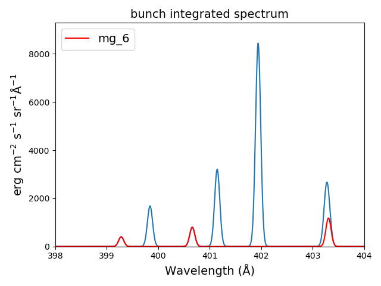

The spectrumPlot method can also be used with bunch after convolve is run

::

  bnch2.spectrumPlot(top=7)

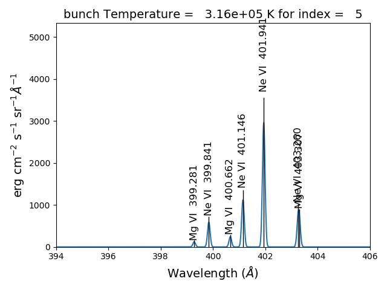

Spectra of multiple ions and continuum
--------------------------------------

the spectrum for all ions in the CHIANTI database can also be calculated

The spectrum for a selection of all of the ions in the CHIANTI database can also be calculated. There are 3 spectral classes.

*  **spectrum** - the single processor implementation that can be used anywhere
*  **mspectrum** - uses the Python multiprocessing class and cannot be used in a IPython qtconsole or notebook
*  **ipymspectrum** [new in v0.6] - uses the IPython parallel class and can be used in a IPython qtconsole or notebook

As of version 0.13.0, it is now possible to save the calculations with the **saveData** methods, demonstrated with the bunch class above

The single processor spectrum class
===================================

::

  temperature = [1.e+6, 2.e+6]
  density = 1.e+9
  wvl = 200. + 0.05*arange(2001)
  emeasure = [1.e+27 ,1.e+27]

::

  s = ch.spectrum(temperature, density, wvl, filter = (chfilters.gaussian,.2), em = emeasure, doContinuum=0, minAbund=1.e-5)

::

  subplot(311)
  plot(wvl, s.Spectrum['integrated'])
  subplot(312)
  plot(wvl, s.Spectrum['intensity'][0])
  subplot(313)
  plot(wvl, s.Spectrum['intensity'][1])

produces

.. image:: _static/spectrum_200_300_3panel.png
    :align:  center

The integrated spectrum is formed by summing the spectra for all temperatures.

  * For minAbund=1.e-6, the calculatation takes 209 s on a 3.5 GHz processor.

  * For minAbund=1.e-5, the calculatation takes 122 s on a 3.5 GHz processor.

The filter is not applied to the continuum.

Save the calculations

::

  saveName = 'spectrum.pkl'
  s.saveData(saveName, verbose=True)

The spectrumPlot method is also available

::

  s.spectrumPlot(integrated=True)

yields

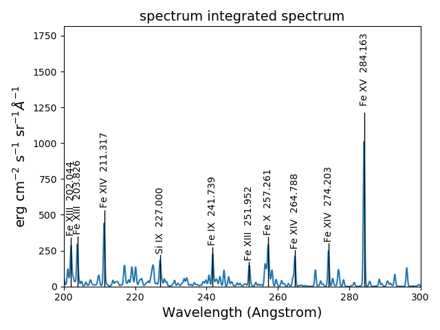

One can return to the saved data at a later date and reload it with the redux class

::

  rdx = ch.redux(saveName)

The inherited spectrumPlot is again available

::

  rdx.spectrumPlot(index=1)

produces a figure like above

Calculations with the Spectrum module can be time consuming.  One way to control the length of time the calculations take is to limit the number of ions with the ionList keyword and to avoid the continuum calculations by setting the doContinuum keyword to 0 or False.  Another way to control the length of time the calculations take is with the minAbund keyword.  It sets the minimum elemental abundance that an element can have for its spectra to be calculated.  The default value is set include all elements.  Some usefull values of minAbund are:

  * minAbund = 1.e-4, will include H, He, C, O, Ne

  * minAbund = 2.e-5 adds  N, Mg, Si, S, Fe

  * minAbund = 1.e-6 adds  Na, Al, Ar, Ca, Ni

The multiple processor mspectrum class
======================================

Another way to speed up calculations is to use the *mspectrum* class which uses multiple cores on your local computer.  It requires the Python *multiprocessing* module which is available with Python versions 2.6 and later. *mspectrum* is called in the same way as *spectrum* but you can specify the number of cores with the *proc* keyword.  The default is 3 but it will not use more cores than are available on your machine.  For example,

::

  temp = [1.e+7, 2.e+7, 3.e+7]
  dens = 1.e+9
  wvl = np.linspace(1.5, 4., 10001)
  emeasure = 1.e+27
  core=6

::

  dwvl = wvl[1] - wvl[0]
  ' dwvl:  %8.4f'%(dwvl)

::

  sm = ch.mspectrum(temperature, density ,wvl, em=emeasure, filter = (chfilters.gaussian, 5.*dwvl), proc=core)

::

  sm.spectrumPlot(wvlRange=[1.84, 1.88], index=2)

yields

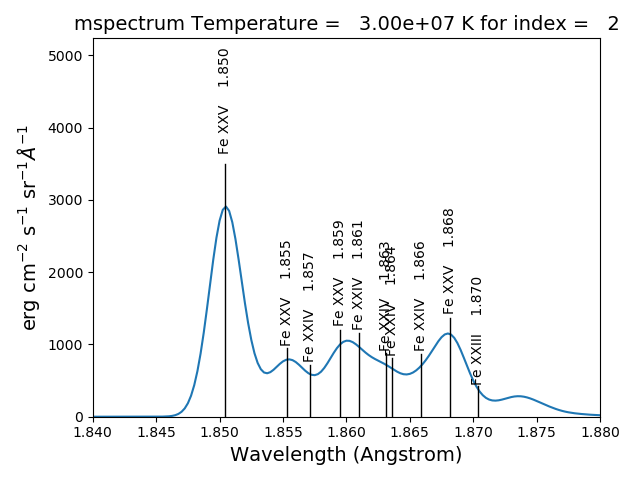

another example

Using differential emission measures (DEM)
------------------------------------------

Beginning with CHIANTI version 14.1, the io.demRead function has been added to read dem file in the existing XUVTOP/dem directory

::

  demDir = os.path.join(os.environ['XUVTOP'], 'dem')
  demList = os.listdir(demDir)

::

  for idx, demFile in enumerate(demList):
      print('%i  %s'%(idx, demFile))

produces

| 0  quiet_sun_eis.dem
| 1  version_3
| 2  coronal_hole.dem
| 3  flare.dem
| 4  flare_ext.dem
| 5  AU_Mic.dem
| 6  quiet_sun.dem
| 7  active_region.dem
| 8  prominence.dem

select the desired file by index

::

  flDict = chio.demRead(demList[3])

::

  flDict.keys()

dict_keys(['temperature', 'density', 'dem', 'em', 'dt', 'ref', 'filename'])

since we will be looking at X-ray wavelengths, select only the highest temperatures

::

  flTemp = flDict['temperature'][20:]
  flDens = flDict['density'][20:]
  flEm = flDict['em'][20:]

::

  wvl = 1. + 0.002*np.arange(4501)
  core = 6

::

  s3 = ch.mspectrum(flTemp, flDens, wvl, filter = (chfilters.gaussian,.015), em=flEm, minAbund=1.e-5, proc=core, verbose=0)

save the calculations
=====================

::

  saveName = 'mspectrum3_dem.pkl'
  s3.saveData(saveName)

::

  plt.figure()
  plt.plot(wvl, s3.Spectrum['intensity'].sum(axis=0))
  plt.xlabel(s3.Spectrum['xlabel'], fontsize=14)
  plt.ylabel(s3.Spectrum['ylabel'], fontsize=14)
  plt.ylim(bottom = 0.)
  plt.xlim([0., wvl[-1]])
  plt.tight_layout()

.. image:: _static/mspectrum_1_10.png
    :align:  center

The spectrumPlot method can also be used

::

  s3.spectrumPlot(top=6)

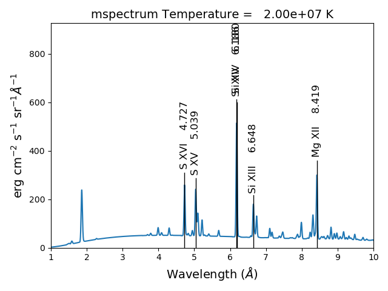

the default value for doContinuum is True, so, the continuum can be plotted separately

::

  plt.figure()
  plt.plot(wvl, s3.FreeFree['intensity'], label='FF')
  plt.plot(wvl, s3.FreeBound['intensity'], label='FB')
  plt.plot(wvl, s3.TwoPhoton['intensity'], label='2 Photon')
  plt.plot(wvl, s3.Continuum['intensity'].sum(axis=0), 'k', label='Total')
  plt.xlabel(s3.Spectrum['xlabel'], fontsize=14)
  plt.ylabel(s3.Spectrum['ylabel'], fontsize=14)
  plt.ylim(bottom = 0.)
  plt.xlim([0., wvl[-1]])
  plt.legend(loc='upper right', fontsize=14)
  plt.tight_layout()

produces

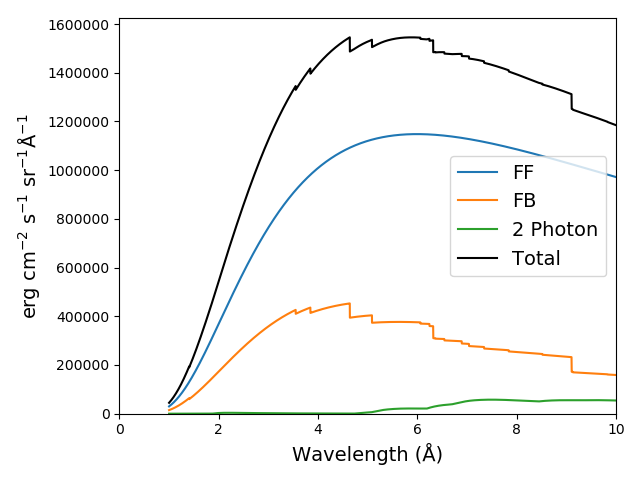

::

  s3.spectrumPlot(wvlRange=[4., 9.], top=6, integrated=True)

produces

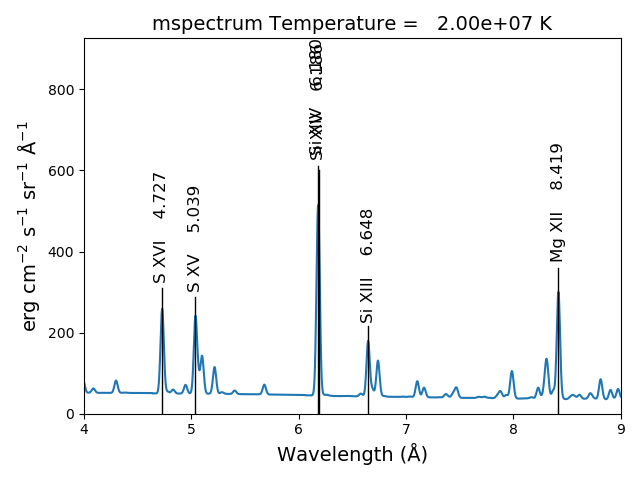

With the redux class, the save calculations can be restored
===========================================================

::

  s3r = ch.redux(saveName, verbose=True)

the redux class inherits the intensityPlot and spectrumPlot methods as well as a few others

::

  s3r.spectrumPlot(wvlRange=[6., 7.], integrated=True, top=5)

.. image:: _static/mspectrum_spectrumPlot_6_7.png
    :align:  center

The multiple processor ipymspectrum class
=========================================

next, we will use the ipymspectrum class.  First, it is necessary to start up the cluster.  In some shell

> ipcluster start   --n=4

or, if you are using Python3

> ipcluster3 start --n=4

this will start 4 engines if you have 4 cores but it won't start more than you have

then in an IPython notebook or qtconsole

::

  temp = [1.e+6, 2.e+6]
  dens = 1.e+9
  wvl = 200. + 0.05*np.arange(2001)
  emeasure = [1.e+27 ,1.e+27]

::

  s = ch.ipymspectrum(temp, dens, wvl, filter = (chfilters.gaussian,.2), \
    em = emeasure, doContinuum=1, minAbund=1.e-5, verbose=True)

::

  plt.figure()
  plt.plot(wvl, s.Spectrum['integrated'])
  plt.ylim(bottom=0.)
  plt.xlim([wvl[0], wvl[-1]])
  plt.title('Integrated')
  plt.xlabel(s.Xlabel, fontsize=14)
  plt.ylabel(s.Ylabel, fontsize=14)
  plt.tight_layout()

produces

.. image:: _static/spectrum_200_300_integrated.png
    :align:  center

spectrum, mspectrum and ipymspectrum can all be instantiated with the same arguments and keyword arguments.  Most of the examples below use the ipymspectrum class for speed.

::

  temperature = 1.e+7
  dens = 1.e+9
  wvl = 10. + 0.005*np.arange(2001)

::

  s = ch.ipymspectrum(temp, dens, wvl, filter = (chfilters.gaussian,.015), \
    elementList=['fe'])

::

  s.spectrumPlot()

produces

.. image:: _static/spectrum_10_20.png
    :align:  center

It is also possible to specify a selection of ions by means of the *ionList* keyword, for example, *ionList=['fe_11','fe_12','fe_13']*

::

  s2 = ch.ipymspectrum(temp, dens, wvl, filter = (chfilters.gaussian,.2), \
    em = emeasure, doContinuum=0, keepIons=1, elementList=['si'])

::

  fig, [ax1, ax2] = plt.subplots(2,1)
  ax1.plot(wvl,s2.Spectrum['intensity'][0])
  ax1.set_ylim(bottom=0.)
  ax1.set_xlim([wvl[0], wvl[-1]])
  ax1.set_ylabel(r'erg cm$^{-2}$ s$^{-1}$ sr$^{-1} \AA^{-1}$', fontsize=14)
  ax2.plot(wvl,s2.IonInstances['si_9'].Spectrum['intensity'][0])
  ax2.set_ylim(bottom=0.)
  ax1.set_xlim([wvl[0], wvl[-1]])
  ax2.set_ylabel(r'erg cm$^{-2}$ s$^{-1}$ sr$^{-1} \AA^{-1}$', fontsize=14)
  ax2.set_xlabel(r'Wavelength ($\AA$)', fontsize=14)
  ax2.set_title('Si IX', fontsize=14)
  fig.tight_layout()

.. image:: _static/spectrum_200_300_w_si_9.png
    :align:  center

Because **keepIons** has been set, the ion instances of all of the ions are maintained in the s2.IonInstances dictionary. It has been possible to compare the spectrum of all of the ions with the spectrum of a single ion.    It should be used with some care as it can lead to very large instances in the case of a large number of ions, temperature, or densities.

::

  temperature = 2.e+7
  density = 1.e+9
  em = 1.e+27
  wvl = 1.84 + 0.0001*arange(601)
  s4 = ch.ipymspectrum(temperature, density ,wvl, filter = (chfilters.gaussian,.0003), \
    doContinuum=1, minAbund=1.e-5, em=em, verbose=0)

::

  s4.spectrumPlot()

produces

.. image:: _static/spectrum_2e7_1.84_1.90.png
    :align:  center

There are two demo notebooks, spectrum_demo.ipynb and spectrum_demo_2.ipynb in the jupyter_notebooks directory on github.

Radiative loss rate
-------------------

the radiative loss rate can be calculated as a function of temperature and density.  If all elements are included, the calculation can take some time.  So, for a shorter example:

::

  temp = 10.**(4.+0.05*np.arange(81))
  dens = 1.e+9
  rlhhe = ch.radLoss(temp, dens, elementList=['h', 'he'])

::

  plt.figure()
  rl.radLossPlot()

produces, in 2s:

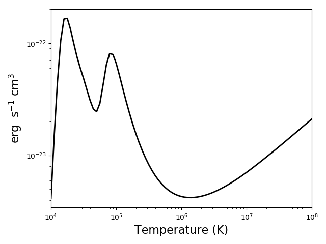

with version 0.15.0, the class mradLoss is available for doing a multiprocessor calculation
of the radiation loss

::

  temp = 10.**(4.+0.05*np.arange(81))
  dens = 1.e+9

the following will calculate the radiation loss for elements with an abundance greater the 1.e-5 that of the hydrogen abundance.  In this case the default abundance file is for photospheric abundances

::

  mrl = ch.mradLoss(temp, dens, minAbund=1.e-5)

these calculations can take some time so it is a good idea to save them

::

  mrl.saveData('rl_phot_1m5.pkl')

::

  plt.figure()
  mrl.radLossPlot()

produces, produces after 250s on a 3.5 GHz 4 core processor:

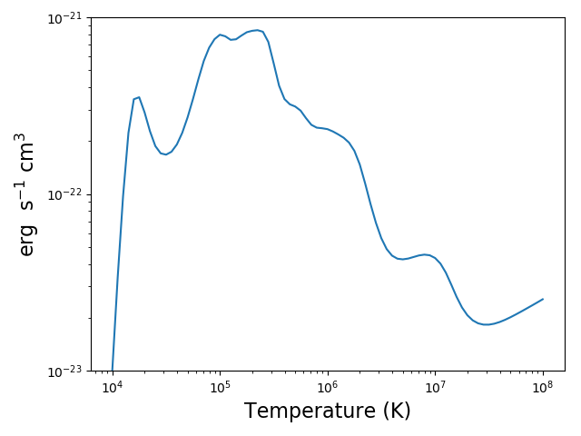

the radiative losses are kept in the rl.RadLoss dictionary

the **abundance** keyword argument can be set to the name of an available abundance file in XUVTOP/abund

if abundance='abc', or some name that does not match an abundance name, a dialog will come up so that a abundance file can be selected

or:

::

  abundDir = os.path.join(os.environ['XUVTOP'], 'abundance')

::

  abundList = os.listdir(abundDir)

::

  for idx, aname in enumerate(abundList):
    print('%5i  %s'%(idx, aname))

to select photospheric abundances

::

  myAbund = abundList[4]

::

 myAbund

::

  mrl2 = ch.radLoss(temp, dens, minAbund=1.e-5, abundance=myAbund, verbose=1)

::

  saveName = 'rl_coronal_1m5.pkl'
  mrl2.saveData(saveName)

::

  plt.figure()
  mrl2.radLossPlot()

produces after 250s on a 3.5 GHz 4 core processor

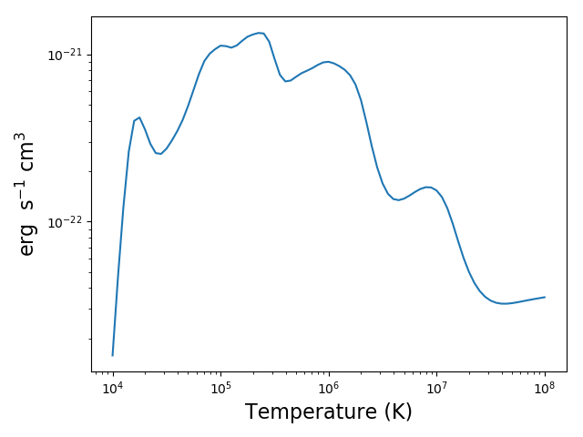

::

  plt.figure()
  plt.loglog(temp, mrl2.RadLoss['rate'], 'k', label='Total')
  plt.loglog(temp, mrl2.BoundBoundLoss, label = 'BB')
  plt.loglog(temp, mrl2.FreeFreeLoss, label = 'FF')
  plt.loglog(temp, mrl2.FreeBoundLoss, label = 'FB')
  plt.loglog(temp, mrl2.TwoPhotonLoss, label = '2P')
  plt.xlabel(mrl2.RadLoss['xlabel'], fontsize=14)
  plt.ylabel(mrl2.RadLoss['ylabel'], fontsize=14)
  plt.legend(loc='lower center', fontsize=14)
  plt.tight_layout()

::

  produces

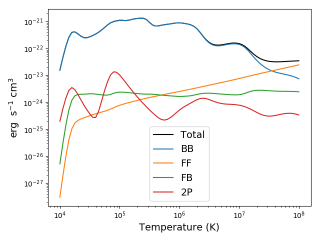

to compare photospheric and coronal radiation losses

::

  rlph = ch.redux(saveNamePhot)
  rlco = ch.redux(saveNameCoronal)

::

  plt.figure()
  plt.loglog(temp, rlph.RadLoss['rate'], label='Phot')
  plt.loglog(temp, rlco.RadLoss['rate'], label='Coronal')
  plt.ylim(bottom=1.e-23, top=2.e-21)
  plt.xlabel(rlph.RadLoss['xlabel'], fontsize=14)
  plt.ylabel(rlph.RadLoss['ylabel'], fontsize=14)
  plt.legend(loc='lower center', fontsize=14)
  plt.tight_layout()

produces

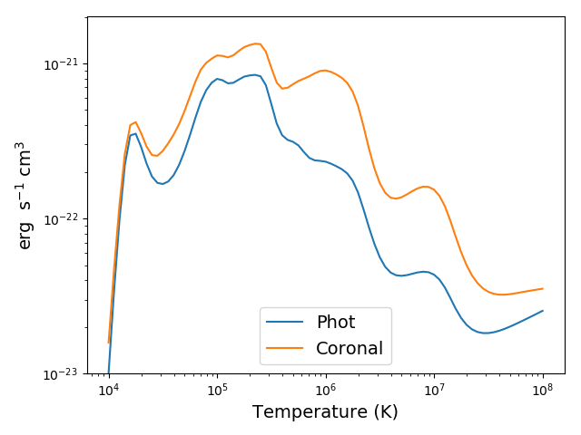

Jupyter Notebooks
-----------------

There are 9 jupyter notebooks in the `jupyter_notebooks`_ directory that demonstrate the capabilities of ChiantyPy together with the CHIANTI database.  There is also a README.txt file that provides a short explanation of the notebooks.

.. _jupyter_notebooks:  https://github.com/chianti-atomic/ChiantiPy/tree/master/jupyter_notebooks

A summary of the notebooks
==========================

This directory contains 9 Jupyter IPython notebooks that demonstrate some of the ways to use ChiantiPy and the CHIANTI database

QuickStart.ipynb - a notebook that generally follows the Quick-Start guide in the docs

A demo of the bunch class is found in:  bunch_demo.ipynb

These notebook show some of the characteristics and capabilities of the bunch class.  Among other things, it shows how to apply labels to plots of line intensities.

Two demos of the spectrum class are found in:  spectrum_demo.ipynb and spectrum_demo_2.ipynb

As with the bunch notebook, these notebook show some of the characteristics and capabilities of the spectrum class.  Among other things, it shows how to apply labels to plots of spectra as a funcition of wavelength.

The directory also contains 5 other notebooks and a json file.  These are demo files for reproducing some of the analyses in the paper "Electron densities and their uncertainties derived from spectral emission line intensities" by Kenneth Dere.  This paper has been published in the Monthly Notices of the Royal Astronomical Society, 2020, 496, 2334.

The notebook file '1_fe_13_demo_make_model.ipynb' constructs the model that is used by 2_fe_13_demo_check_model.ipynb and 3_fe_13_demo_chi2_search.ipynb by reading the 'tab2_1993_qs_fe_13.json' file.  It is easiest if all files are placed in the same directory.  This files contains the Fe XIII line intensities from Brosius et al., 1996, Astrophysical Journal Supplement Series, 106, 143.  This notebook file needs to be run first.

The next notebook to run is:  2_fe_13_demo_check_model.ipynb  -- This notebook load the previously created pickle containing the match attribute.  In this notebook a density and emission measure are guessed from an 'em loci' plot and the predictions compard with the observations.

The next notebook to run is:  3_fe_13_demo_chi2_search.ipynb -- This performs a brute force chi-squared search over the density range and finds the best fit density and emission measure.  These best values are then inserted into the model, a prediction made and compared with the observations.

The next notebook to run is:  4_fe_13_demo_mcmc.ipynb -- This performs a MCMC analysis of the spectra to determine the most likely density and emission measure from an analysis of the trace.  The trace is also save for futher analysis.

The next notebook to run is:  5_fe_13_demo_mcmc_trace_analyze.ipynb -- the load the trace so that it can be re-analyzed

QuickStart.ipynb
================

bunch_demo.ipynb
================

spectrum_demo.ipynb
===================

spectrum_demo_2.ipynb
=====================

1_fe_13_demo_make_match.ipynb
=============================

2_fe_13_demo_check_model.ipynb
==============================

3_fe_13_demo_chi2_search.ipynb
==============================

4_fe_13_demo_mcmc.ipynb
=======================

5_fe_13_demo_mcmc_trace_analyze.ipynb
=====================================

